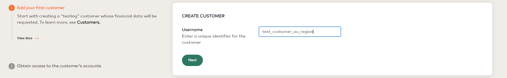
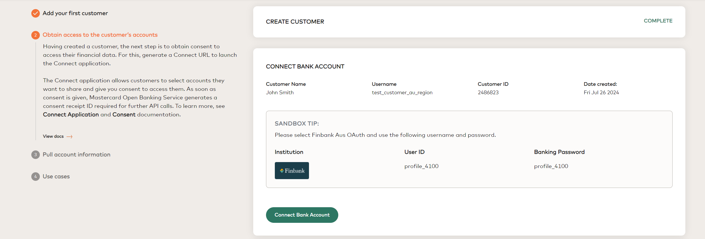
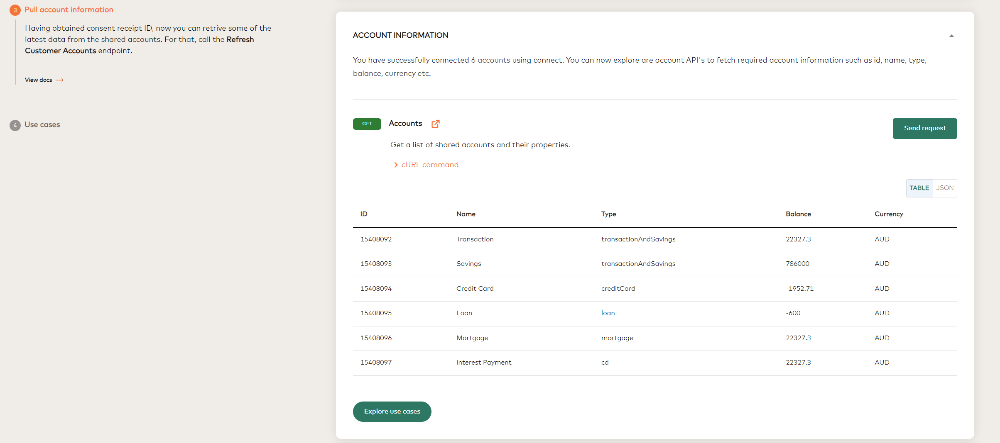
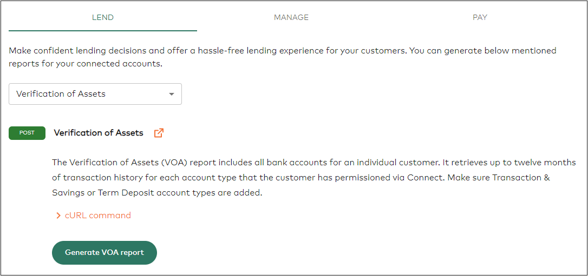
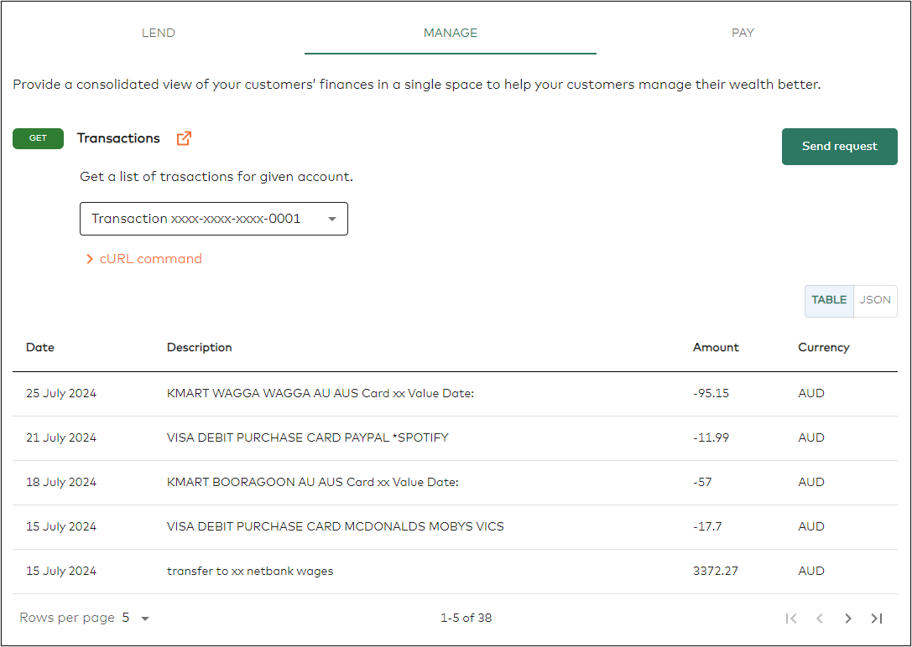

# Open Banking Reference Application Australia

[](https://sonarcloud.io/summary/new_code?id=Mastercard_open-banking-reference-application-australia)

[](https://sonarcloud.io/summary/new_code?id=Mastercard_open-banking-reference-application-australia)
[](https://sonarcloud.io/summary/new_code?id=Mastercard_open-banking-reference-application-australia)
[](https://sonarcloud.io/summary/new_code?id=Mastercard_open-banking-reference-application-australia)

## Table of Contents

-   [Overview](#overview)
    -   [Connect & Consent](#connect-and-consent)
    -   [References](#references)
-   [Set up](#set-up)
    -   [Compatibility](#compatibility)
    -   [Installation](#Installation)
    -   [Test](#test)
-   [Demo](#demo)
    1. [Generate your credentials](#1-generate-your-credentials)
    2. [Add credentials to the .env file](#2-add-credentials-to-the-env-file)
    3. [Run application](#3-run-application)
    4. [Create your first customer](#4-create-your-first-customer)
    5. [Add a bank account to customer](#5-add-a-bank-account-to-customer)
    6. [Pull account information](#6-pull-account-information)
    7. [Explore usecases](#7-explore-usecases)
-   [Hosting Reference App](#hosting-reference-app)
-   [Contact Us](#contact-us)

## Overview

The Open Banking Reference App allows you to explore [Mastercard's Open Banking Service (MOBS) For Australia](https://developer.mastercard.com/open-banking-au/documentation/) to incorporate it into your product. This application allows you to:

-   Create test customers
-   Obtain consent to access test accounts data
-   Retrieve the data from the shared accounts
-   Explore the solutions offered by Mastercard Open Banking

> **IMPORTANT**: Please note that applications accessing the Mastercard Open Banking APIs must be hosted within Australia.

### Connect and Consent

The Reference App includes a launch of [Connect](https://developer.mastercard.com/open-banking-au/documentation/connect/) - a MOBS product which facilitates the collection of consent from an end user (customer) to access their financial data.
[Consent](https://developer.mastercard.com/open-banking-au/documentation/consent/) is required by CDR regulation in Australia to get access to the consumer’s financial data. Integrating Connect with your product will streamline the process of obtaining consent while following the compliance rules. After consent is given, the Reference App shows how the consent receipt ID can be fetched in order to make further calls to FIs.

### References

-   [Test profiles](https://developer.mastercard.com/open-banking-au/documentation/test-the-apis/)
-   [API Reference](https://developer.mastercard.com/open-banking-au/documentation/api-reference/)
-   [Connect SDK](https://developer.mastercard.com/open-banking-au/documentation/connect/integrating-with-connect/)

## Set up

### Compatibility

-   **Node (v14+)**
-   **React (v18.3.1)**

This application is built using the React framework. React requires Node version 14+.
However, It is recommended that you use one of NodeJS's LTS releases or one of the [more general recent releases](https://github.com/nodejs/Release). A Node version manager such as [nvm](https://github.com/creationix/nvm) (Mac and Linux) or [nvm-windows](https://github.com/coreybutler/nvm-windows) can help with this.

### Installation

Before using the Reference App, you will need to set up a project in the local machine.
The following commands will help you to get the latest code:

```shell
git clone https://github.com/Mastercard/open-banking-reference-application-australia.git

cd open-banking-reference-application-australia
```

### Test

You can run the following command to execute the test cases against the latest version of the Reference App:

```shell
npm run test
```


## Demo

### 1. Generate your credentials

-   Login to the [Mastercard developer's portal](https://developer.mastercard.com/product/open-banking/)
-   Log in and click the **Create New Project** button at the top left of the page.
-   Enter your project name and select Open Banking as the API service, then click on the **Proceed** button.
-   Select **Australia** in the Commercial Countries drop down list, and click on the **Proceed** button.
-   Enter a description of your project on the next page, and click on the **Create Project** button.
-   Take note of your Partner ID, Partner Secret and App Key. These will be required in the following sections.

For more details see [Onboarding](https://developer.mastercard.com/open-banking-au/documentation/onboarding/).


### 2. Add credentials to the .env file

The Open Banking Reference App needs Sandbox API credentials adding to the `.env` file to make the API calls:

1. Create the `.env` file.
    ```shell
     cp .env.template .env
    ```
2. Update the `.env` file with your Sandbox API credentials generated in step 1.
3. The default value of `REACT_APP_AUTO_CREATE_CUSTOMER` is set to `false`. If the customer creation needs to be initated automatically then the value should be set to `true`

### 3. Setup and Run the application

-   ##### Run without docker
    The following command will install the required depdendancies on your machine. (This command should be executed during the initial setup)
    ```
    npm i
    ```
    Execute the following command to start the Reference App:
    ```shell
    npm start
    ```
-   ##### Run with docker

    **Pre-requisites** - Docker installed and running on your machine: https://docs.docker.com/get-docker/

    The followind command will create the docker image of the application and will start the application.

    ```
    docker compose up
    ```

When the application is launched in a browser, it prompts either to proceed with demo or go to GitHub. Select **View Demo**.
This will redirect you to the first step of the user flow.


### 4. Create your first customer

To access any financial data, first you need to create a customer. Provide a unique identifier for the customer.
To proceed further, select **Next**.



or

If you have configured `REACT_APP_AUTO_CREATE_CUSTOMER` to true then the customer will be created automatically.


### 5. Add a bank account to customer

Now that you have a **Customer ID**, the next step is to add a bank account. The screen lists a name of the Financial Institution and credentials to use during Connect flow.
To start, select **Connect Bank Account**:



This flow is a simulation of what a customer will see when consenting to share their financial data with you.
In Connect flow:

1. Search for **Finbank Aus OAuth**.
2. Check all boxes, and then click **I consent**.
3. Click **Next**.
4. Type profile_4100 and profile_4100 when asked for a username and password.
5. Select all accounts, and then click Submit/Continue.
6. Click **Submit** to receive the customer’s consent.


When the consent to access accounts is successfully obtained and Connect is closed,
the Reference App is now ready to access the consented accounts.

### 6. Pull account information

At this point having customer ID and consent receipt ID allows you to retrieve the financial data from consented accounts. The Reference App shows examples of how to retrieve following data elements with the help of Mastercard open banking API's:

1. Account id
2. Account name
3. Account type
4. Balance
5. Currency



### 7. Explore usecases

The use cases section provides you with an overview of the different solutions offered by Mastercard Open Banking.

-   **Lend**
    Make confident lending decisions and offer a hassle-free lending experience for your customers with the help of **Reports**.



-   **Manage**
    Provide a consolidated view of your customers’ finances in a single space to help your customers manage their wealth better.



-   **Pay**
    Provide a seamless payment experience for your customers.


## Hosting Reference App

To host the Reference App on your server, run the following command to create the application build:

```
npm run build
```

Refer to the below code snippet for creating an [express](https://www.npmjs.com/package/express) application. Note, that to handling proxy requests to MOBS APIs, we are using [http-proxy-middleware](https://www.npmjs.com/package/http-proxy-middleware). Alternatively, you can set up your proxy server for managing CORS (cross-origin-resource-sharing).

```
const express = require('express');
const {createProxyMiddleware} = require('http-proxy-middleware');
const app = express();
const port = process.env.PORT || 4000;

app.use(express.static('build'));
app.use(
    ['/aggregation', '/notifications', '/connect'],
    createProxyMiddleware({
        target: 'https://api.openbanking.mastercard.com.au/',
        changeOrigin: true,
    })
);
app.use(
    '/token',
    createProxyMiddleware({
        target: 'https://webhook.site/',
        changeOrigin: true,
    })
);

app.listen(port, () => {
  console.log(`Example app listening on port ${port}`);
});
```

## Contact Us

Have issues or concerns regarding the application?
Please create an issue in the GitHub and our team will try to address the issue as soon as possible.
